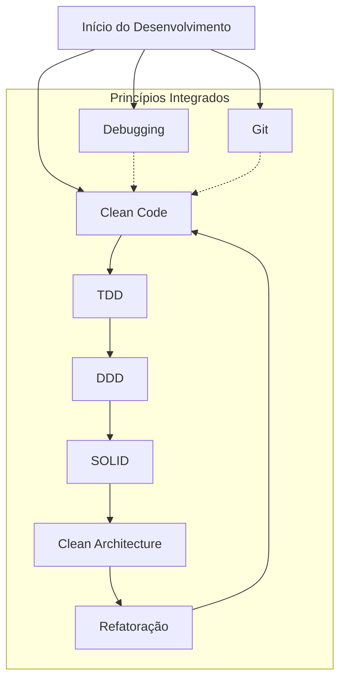

# 🏗️ Architecture Guidelines

## 🚨 **COMPORTAMENTO OBRIGATÓRIO**

### **Ações Críticas de Desenvolvimento**

1. **SEMPRE consultem** as regras especializadas para implementação específica
2. **SEMPRE sigam** princípios fundamentais de Clean Code, TDD e DDD
3. **SEMPRE usem** refatoração contínua para manter qualidade
4. **SEMPRE apliquem** técnicas apropriadas para cada domínio
5. **SEMPRE mantenham** consistência entre regras especializadas
6. **SEMPRE consulte** [Core Rule](core-rule.mdc) para diretrizes fundamentais

## 🎯 **REGRAS ESPECIALIZADAS**

### **1. Clean Code**

**SEMPRE consultem** regras especializadas de Clean Code para:

- Princípios fundamentais de código limpo
- Nomes significativos e responsabilidade única
- Eliminação de duplicação e encapsulamento
- Estrutura limpa e manutenibilidade

**Aplicação**: Código limpo, legível e manutenível

### **2. Test-Driven Development (TDD)**

**🚨 CRÍTICO**: **SEMPRE escreva pelo menos 1 teste simples ANTES de implementar qualquer código**.

**Protocolo Obrigatório de TDD**:

1. **SEMPRE comunique** claramente ao usuário que está seguindo TDD antes de começar
2. **SEMPRE escreva** pelo menos 1 teste simples que descreve o comportamento esperado
3. **SEMPRE verifique** se o teste falha (Red) antes de implementar
4. **SEMPRE implemente** apenas o código mínimo necessário para o teste passar (Green)
5. **SEMPRE refatore** mantendo os testes verdes (Refactor)

**Quando não é possível fazer testes**:

- **SEMPRE confirme** com o usuário de forma clara e objetiva quando:
  - O projeto ainda não possui estrutura de testes configurada
  - A empresa/projeto não tem cultura de testes implementada
  - Não há ferramentas de teste disponíveis no ambiente
- **SEMPRE pergunte** explicitamente: "Este projeto possui estrutura de testes configurada? Posso criar pelo menos 1 teste antes de implementar?"
- **NUNCA assuma** que pode pular testes sem confirmação explícita do usuário
- **SEMPRE documente** a decisão quando testes não forem aplicáveis

**SEMPRE consultem** regras especializadas de TDD para:

- Protocolos rigorosos de TDD com ciclo Red-Green-Refactor
- Desenvolvimento orientado a testes
- Cobertura de testes e qualidade (>90%)
- Verificação do usuário em passos atômicos

**Aplicação**: Desenvolvimento com testes PRIMEIRO, sempre comunicando ao usuário

### **3. Domain-Driven Design (DDD)**

**SEMPRE consultem** regras especializadas de DDD para:

- Modelagem de domínio e linguagem ubíqua
- Entidades, agregados e value objects
- Serviços de domínio e bounded contexts
- Arquitetura orientada ao negócio

**Quando a aplicação fica muito complexa**:

- **SEMPRE considere** aplicar DDD sobre Clean Architecture, Arquitetura Cebola (Onion Architecture) ou Arquitetura Hexagonal
- **SEMPRE use** DDD para modelar domínios complexos com múltiplos bounded contexts
- **SEMPRE combine** DDD com Clean Architecture para isolar regras de negócio
- **SEMPRE aplique** Onion Architecture quando precisar de camadas bem definidas com domínio no centro
- **SEMPRE use** Arquitetura Hexagonal (Ports & Adapters) para desacoplar aplicação de frameworks externos

**Aplicação**: Arquitetura orientada ao domínio, especialmente em aplicações complexas

### **4. SOLID Principles**

**SEMPRE apliquem** os cinco princípios SOLID:

- **SRP (Single Responsibility)**: Uma única responsabilidade por classe
- **OCP (Open/Closed)**: Aberto para extensão, fechado para modificação
- **LSP (Liskov Substitution)**: Subtipos substituíveis por tipos base
- **ISP (Interface Segregation)**: Interfaces específicas, não "gordas"
- **DIP (Dependency Inversion)**: Depender de abstrações, não implementações

**Aplicação**: Design de classes e interfaces robustas

### **5. Clean Architecture**

**SEMPRE consultem** princípios de Clean Architecture para:

- Separação de responsabilidades em camadas (Entities, Use Cases, Interface Adapters, Frameworks)
- Dependency Rule: dependências apontam para dentro (camadas externas dependem de internas)
- Independência de frameworks, UI, banco de dados e agências externas
- Testabilidade: lógica de negócio isolada e testável sem dependências externas
- Flexibilidade: troca de tecnologias sem impactar regras de negócio

**Camadas da Clean Architecture**:

1. **Entities (Domínio)**: Regras de negócio puras, independentes de frameworks
2. **Use Cases (Aplicação)**: Orquestração de fluxos de negócio específicos
3. **Interface Adapters**: Conversão de dados entre camadas (Controllers, Presenters, Gateways)
4. **Frameworks & Drivers**: Infraestrutura (Web, DB, UI, APIs externas)

**SEMPRE respeitem** a Dependency Rule:

- **SEMPRE façam** dependências apontarem para dentro (camadas externas → internas)
- **SEMPRE usem** inversão de dependência (DIP) para interfaces
- **SEMPRE isolem** regras de negócio de detalhes de implementação
- **SEMPRE garantam** que Entities e Use Cases não dependam de frameworks

**SEMPRE organizem** código seguindo camadas:

- **Domain Layer**: Entidades, value objects, regras de negócio puras
- **Application Layer**: Casos de uso, serviços de aplicação, DTOs
- **Infrastructure Layer**: Implementações concretas (repositórios, APIs, frameworks)
- **Presentation Layer**: Controllers, views, componentes de UI

**Quando a aplicação fica muito complexa**:

- **SEMPRE combine** Clean Architecture com DDD para modelagem de domínios complexos
- **SEMPRE considere** Onion Architecture quando precisar de camadas bem definidas
- **SEMPRE use** Arquitetura Hexagonal (Ports & Adapters) para desacoplar de frameworks
- **SEMPRE aplique** Clean Architecture no frontend quando serviços de API se tornam muito complexos
- **SEMPRE crie** camada de infrastructure para isolar comunicação com APIs complexas

**Aplicação**: Arquitetura escalável, testável e independente de frameworks, especialmente em aplicações complexas

### **6. Arquiteturas por Camada**

#### **6.1 Backend: Model-View-Controller (MVC)**

**SEMPRE use** MVC no backend quando:

- Aplicação segue padrão tradicional de frameworks (Rails, Grails, Spring MVC)
- Separação clara entre lógica de negócio (Model), apresentação (View) e controle (Controller)
- Necessidade de manter compatibilidade com estrutura existente

**SEMPRE organize** seguindo MVC:

- **Model**: Entidades de domínio, regras de negócio, acesso a dados
- **View**: Templates, serialização JSON, apresentação de dados
- **Controller**: Orquestração de requisições, validação, coordenação entre Model e View

**Quando a aplicação fica muito complexa**:

- **SEMPRE combine** MVC com DDD para modelagem de domínios complexos
- **SEMPRE aplique** Clean Architecture sobre MVC para isolar regras de negócio
- **SEMPRE use** Onion Architecture ou Hexagonal quando precisar desacoplar de frameworks
- **SEMPRE considere** migração gradual de MVC para Clean Architecture em módulos complexos

**Aplicação**: Padrão MVC no backend, combinado com DDD e Clean Architecture quando necessário

#### **6.2 Frontend: Arquitetura de Features (React)**

**SEMPRE use** arquitetura de features no frontend React quando:

- Aplicação React com múltiplas funcionalidades
- Necessidade de organizar código por domínio de negócio
- Escalabilidade e manutenibilidade são prioridades
- Equipes trabalham em features independentes

**SEMPRE organize** seguindo arquitetura de features:

- **Features**: Cada feature é um módulo independente e autocontido
- **Estrutura por feature**: Componentes, hooks, serviços, tipos e testes agrupados por feature
- **Shared/Common**: Código compartilhado entre features (componentes, hooks, utils)
- **Separação clara**: Cada feature encapsula sua lógica de negócio

**Estrutura recomendada para React com arquitetura de features**:

```text
src/
├── features/            # Módulos de features independentes
│   ├── feature-name/    # Cada feature é autocontida
│   │   ├── components/ # Componentes específicos da feature
│   │   ├── hooks/      # Hooks customizados da feature
│   │   ├── services/   # Serviços e lógica de negócio
│   │   ├── types/      # Tipos TypeScript da feature
│   │   ├── utils/      # Utilitários da feature
│   │   └── index.ts    # Exportações públicas da feature
│   └── ...
├── shared/              # Código compartilhado entre features
│   ├── components/      # Componentes reutilizáveis
│   ├── hooks/          # Hooks compartilhados
│   ├── utils/          # Utilitários compartilhados
│   └── types/          # Tipos compartilhados
└── infrastructure/     # Camada de infrastructure (quando necessário)
    ├── api/            # Clientes HTTP, endpoints
    ├── services/       # Serviços de orquestração
    └── mappers/        # Conversão DTO ↔ Model
```

**Quando a aplicação fica muito complexa**:

- **SEMPRE combine** arquitetura de features com Clean Architecture para isolar regras de negócio
- **SEMPRE crie** camada de infrastructure para comunicação com APIs complexas
- **SEMPRE mantenha** features independentes e desacopladas
- **SEMPRE use** Clean Architecture no frontend quando serviços de API se tornam muito complexos
- **SEMPRE isole** comunicação HTTP em camada de infrastructure quando necessário

**SEMPRE siga** estes princípios:

- **SEMPRE mantenha** features autocontidas e independentes
- **SEMPRE evite** dependências entre features (use shared quando necessário)
- **SEMPRE isole** lógica de negócio dentro de cada feature
- **SEMPRE use** camada de infrastructure para APIs complexas compartilhadas
- **SEMPRE organize** código por domínio de negócio, não por tipo técnico

**Aplicação**: Arquitetura de features no frontend React, especialmente quando a aplicação cresce em complexidade

#### **6.3 Frontend: Clean Architecture**

**SEMPRE aplique** Clean Architecture no frontend quando:

- Serviços de API se tornam muito complexos
- Necessidade de isolar lógica de negócio de detalhes de implementação
- Múltiplas integrações com APIs externas
- Necessidade de testabilidade e manutenibilidade

**SEMPRE crie** camada de infrastructure para APIs complexas:

- **SEMPRE isole** comunicação HTTP em camada de infrastructure
- **SEMPRE crie** serviços especializados para cada API complexa
- **SEMPRE use** mappers para converter DTOs em modelos de domínio
- **SEMPRE mantenha** regras de negócio fora da camada de infrastructure

**Estrutura recomendada para frontend com Clean Architecture**:

```text
src/
├── domain/              # Entidades, value objects, regras de negócio puras
├── application/         # Casos de uso, serviços de aplicação
├── infrastructure/     # APIs, HTTP clients, mappers, DTOs
│   ├── api/            # Clientes HTTP, endpoints
│   ├── services/       # Serviços de orquestração
│   └── mappers/        # Conversão DTO ↔ Model
└── presentation/       # Componentes UI, ViewModels, Views
```

**SEMPRE siga** estes princípios:

- **SEMPRE mantenha** domain layer independente de frameworks
- **SEMPRE isole** infrastructure layer para comunicação externa
- **SEMPRE use** application layer para orquestração de casos de uso
- **SEMPRE separe** presentation layer de lógica de negócio

**Aplicação**: Clean Architecture no frontend, especialmente para serviços de API complexos

### **7. Refatoração**

**SEMPRE consultem** técnicas de refatoração para:

- Técnicas de refatoração seguras mantendo funcionalidade
- Identificação e eliminação de code smells (métodos longos, muitos parâmetros, duplicação)
- Refatoração incremental com testes
- Extrair método/classe, renomear variável, eliminar duplicação

**Aplicação**: Melhoria contínua de qualidade

### **8. Debugging e Investigação**

**SEMPRE sigam** processo estruturado de investigação:

- **SEMPRE analisem** logs para identificar problemas
- **SEMPRE verifiquem** arquivos e configurações antes de assumir problema
- **SEMPRE usem** logs estratégicos com contexto relevante
- **SEMPRE prefiram** execução de testes para debugging complexo
- **SEMPRE mapeiem** fluxo completo antes de investigar problemas

**Aplicação**: Resolução eficiente de problemas

### **9. Git e Versionamento**

**SEMPRE usem** Conventional Commits e padrões de branches:

- **Padrão de branch**: `<prefixo-opcional>-CAP-<número>-<descrição>` ou `CAP-<número>-<descrição>`
- **Tipos de commit**: `feat`, `fix`, `docs`, `style`, `refactor`, `test`, `chore`, `build`, `ci`, `perf`, `revert`, `merge`, `hotfix`
- **Formato**: `<tipo>(<escopo>): <descrição>`
- **SEMPRE configurem** hooks Git para validação automática

**Aplicação**: Rastreabilidade e colaboração eficiente

## 🔧 **INTEGRAÇÃO ENTRE REGRAS**

### **Fluxo de Trabalho Integrado**



### **Sistema de Referências**

- **Clean Code** → Base para todas as outras regras
- **TDD** → Garante qualidade através de testes
- **DDD** → Orienta arquitetura e modelagem (especialmente em aplicações complexas)
- **SOLID** → Design de classes e interfaces robustas
- **Clean Architecture** → Estrutura de camadas e independência de frameworks
- **MVC** → Padrão tradicional no backend (Rails, Grails, Spring MVC)
- **Arquitetura de Features** → Organização por features no frontend React quando aplicação cresce em complexidade
- **Onion Architecture** → Camadas bem definidas com domínio no centro
- **Hexagonal Architecture** → Desacoplamento de frameworks (Ports & Adapters)
- **Infrastructure Layer** → Isolamento de APIs complexas no frontend
- **Refatoração** → Mantém qualidade contínua
- **Debugging** → Resolução eficiente de problemas
- **Git** → Rastreabilidade e colaboração

## 📋 **EXEMPLOS DE USO**

### **Exemplo 1: Desenvolvimento de Nova Funcionalidade**

1. **🚨 CRÍTICO**: **SEMPRE comunique** ao usuário que seguirá TDD antes de começar
2. **🚨 CRÍTICO**: **SEMPRE confirme** se o projeto possui estrutura de testes (se não tiver, pergunte explicitamente)
3. **SEMPRE escreva** pelo menos 1 teste simples que descreve o comportamento esperado (Red)
4. **SEMPRE implemente** apenas o código mínimo para o teste passar (Green)
5. **SEMPRE refatore** mantendo os testes verdes (Refactor)
6. **SEMPRE consultem** regras especializadas de DDD para modelar domínio
7. **SEMPRE consultem** princípios SOLID para design de classes robustas
8. **SEMPRE consultem** Clean Architecture para organizar camadas e dependências
9. **SEMPRE use** MVC no backend quando aplicável (Rails, Grails, Spring MVC)
10. **SEMPRE use** arquitetura de features no frontend React quando aplicação cresce em complexidade
11. **SEMPRE aplique** Clean Architecture no frontend para APIs complexas
12. **SEMPRE crie** camada de infrastructure para isolar comunicação com APIs complexas
13. **SEMPRE consultem** regras especializadas de Clean Code para implementar código limpo
14. **SEMPRE consultem** regras especializadas de refatoração para melhorar continuamente

### **Exemplo 2: Correção de Bug**

1. **SEMPRE consultem** técnicas de debugging para investigar o problema sistematicamente
2. **🚨 CRÍTICO**: **SEMPRE comunique** ao usuário que seguirá TDD para corrigir o bug
3. **🚨 CRÍTICO**: **SEMPRE confirme** se o projeto possui estrutura de testes (se não tiver, pergunte explicitamente)
4. **SEMPRE escreva** pelo menos 1 teste que reproduz o bug (Red)
5. **SEMPRE implemente** a correção mínima para o teste passar (Green)
6. **SEMPRE refatore** mantendo os testes verdes (Refactor)
7. **SEMPRE consultem** princípios SOLID para verificar violações de princípios
8. **SEMPRE consultem** regras especializadas de Clean Code para corrigir com código limpo
9. **SEMPRE consultem** regras especializadas de refatoração para eliminar code smells

### **Exemplo 3: Refatoração de Código Legado**

1. **SEMPRE consultem** regras especializadas de refatoração para identificar code smells
2. **SEMPRE consultem** regras especializadas de TDD para adicionar testes
3. **SEMPRE consultem** princípios SOLID para aplicar design robusto
4. **SEMPRE consultem** Clean Architecture para reorganizar camadas e dependências
5. **SEMPRE considere** aplicar DDD sobre Clean Architecture quando aplicação fica muito complexa
6. **SEMPRE considere** Onion Architecture ou Hexagonal quando precisar desacoplar de frameworks
7. **SEMPRE migre** gradualmente de MVC para Clean Architecture em módulos complexos
8. **SEMPRE use** arquitetura de features no frontend React quando aplicação cresce em complexidade
9. **SEMPRE crie** camada de infrastructure no frontend para APIs complexas
10. **SEMPRE consultem** regras especializadas de Clean Code para aplicar princípios
11. **SEMPRE consultem** regras especializadas de DDD para melhorar modelagem
12. **SEMPRE usem** Git com Conventional Commits para rastreabilidade

## 🚫 **LIMITES ABSOLUTOS**

- **🚨 CRÍTICO**: **NUNCA implementem** código sem pelo menos 1 teste simples antes
- **🚨 CRÍTICO**: **NUNCA assumam** que podem pular testes sem confirmação explícita do usuário
- **🚨 CRÍTICO**: **NUNCA iniciem** TDD sem comunicar claramente ao usuário
- **NUNCA implementem** sem consultar regras especializadas
- **NUNCA ignorem** princípios fundamentais de qualidade
- **NUNCA façam** refatoração sem testes adequados
- **NUNCA misturem** responsabilidades de domínios diferentes
- **NUNCA ignorem** necessidade de Clean Architecture quando aplicação fica muito complexa
- **NUNCA misturem** lógica de negócio com camada de infrastructure no frontend
- **NUNCA deixem** de criar camada de infrastructure para APIs complexas no frontend

## 📚 **INTEGRAÇÃO COM OUTRAS REGRAS**

### **Regras Relacionadas**

- **Core Rule**: [core-rule.mdc](core-rule.mdc) - Diretrizes fundamentais e sistema de modos
- **Memory Core**: [memory-core.mdc](memory-core.mdc) - Gestão de conhecimento e memória
- **Clean Code**: Regras especializadas de Clean Code - Princípios fundamentais
- **TDD**: Regras especializadas de TDD - Desenvolvimento orientado a testes
- **DDD**: Regras especializadas de DDD - Domain-Driven Design
- **SOLID**: Princípios de design orientado a objetos (SRP, OCP, LSP, ISP, DIP)
- **Clean Architecture**: Arquitetura em camadas e independência de frameworks
- **Refatoração**: Técnicas de melhoria contínua e eliminação de code smells
- **Debugging**: Técnicas sistemáticas de investigação e resolução de problemas
- **Git**: Padrões de versionamento com Conventional Commits

## ✅ **VERIFICAÇÃO FINAL**

Antes de concluir QUALQUER tarefa:

- [ ] **🚨 CRÍTICO**: **TDD foi comunicado** claramente ao usuário antes de começar
- [ ] **🚨 CRÍTICO**: **Estrutura de testes foi confirmada** com o usuário (ou exceção documentada)
- [ ] **🚨 CRÍTICO**: **Pelo menos 1 teste simples** foi escrito antes da implementação
- [ ] **Regras especializadas** foram consultadas
- [ ] **Princípios fundamentais** foram aplicados
- [ ] **Qualidade de código** foi mantida
- [ ] **Testes adequados** foram implementados (ou exceção confirmada com usuário)
- [ ] **Arquitetura orientada ao domínio** foi respeitada (DDD quando aplicação é complexa)
- [ ] **Princípios SOLID** foram aplicados
- [ ] **Clean Architecture** foi aplicada (camadas e Dependency Rule)
- [ ] **MVC no backend** foi usado quando aplicável (Rails, Grails, Spring MVC)
- [ ] **Arquitetura de features no frontend React** foi aplicada quando aplicação cresce em complexidade
- [ ] **Clean Architecture no frontend** foi aplicada para APIs complexas
- [ ] **Camada de infrastructure** foi criada para isolar APIs complexas no frontend
- [ ] **Onion/Hexagonal Architecture** foi considerada quando aplicação fica muito complexa
- [ ] **Refatoração contínua** foi aplicada
- [ ] **Debugging sistemático** foi utilizado quando necessário
- [ ] **Git e versionamento** seguiram padrões estabelecidos

## 🔗 **REFERÊNCIAS**

### **Regras Especializadas**

- [Core Rule](core-rule.mdc) - Diretrizes fundamentais e sistema de modos
- [Memory Core](memory-core.mdc) - Gestão de conhecimento e memória
- **SOLID**: Princípios de design orientado a objetos (SRP, OCP, LSP, ISP, DIP)
- **TDD**: Regras especializadas de TDD - Test-Driven Development
- **DDD**: Regras especializadas de DDD - Domain-Driven Design (especialmente em aplicações complexas)
- **Clean Architecture**: Arquitetura em camadas e independência de frameworks
- **Onion Architecture**: Camadas bem definidas com domínio no centro
- **Hexagonal Architecture**: Desacoplamento de frameworks (Ports & Adapters)
- **MVC**: Model-View-Controller no backend (Rails, Grails, Spring MVC)
- **Arquitetura de Features**: Organização por features no frontend React quando aplicação cresce em complexidade
- **Infrastructure Layer**: Isolamento de APIs complexas no frontend
- **Clean Code**: Regras especializadas de Clean Code - Princípios fundamentais
- **Refatoração**: Técnicas de melhoria contínua e eliminação de code smells
- **Debugging**: Técnicas sistemáticas de investigação e resolução de problemas
- **Git**: Padrões de versionamento com Conventional Commits

**Automação**: Configure ferramentas para validação automática de todas as regras especializadas
