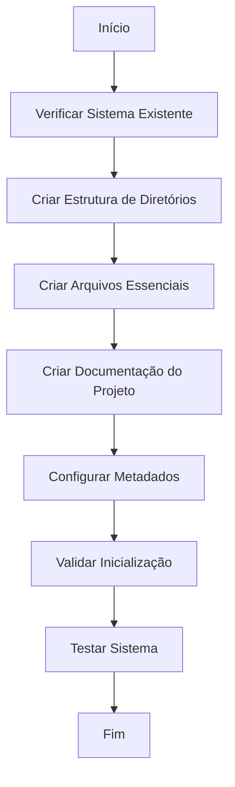

# Inicializar Sistema de Memória - Comando Cursor IDE

## Overview

Inicializa o sistema de memória do Cursor IDE criando estrutura de diretórios,
arquivos essenciais e documentação do projeto. Este comando garante que o
sistema de memória esteja configurado adequadamente para comandos customizados
do Cursor IDE.

## Parâmetros

- **--backup**: Criar backup automático antes da inicialização (padrão: true)
- **--validate**: Executar validação completa após inicialização (padrão: true)
- **--dry-run**: Apenas mostrar mudanças sem aplicar (opcional)

## 1. Contexto e Preparação

- [ ] **SEMPRE identifique** se o sistema de memória já está inicializado
- [ ] **SEMPRE faça** backup de arquivos existentes antes de qualquer alteração
- [ ] **SEMPRE verifique** se a estrutura de diretórios está adequada
- [ ] **SEMPRE foque** exclusivamente em comandos customizados do Cursor IDE

## 2. Análise e Diagnóstico

- [ ] **SEMPRE verifique** se arquivos essenciais existem:
  - [ ] `activeContext.md` - Memória de trabalho
  - [ ] `evolution.mdc` - Conhecimento evolucional
  - [ ] Estrutura de diretórios adequada
- [ ] **SEMPRE verifique** se documentação do projeto existe:
  - [ ] `README.md` na raiz do projeto
  - [ ] Pasta `docs/` com documentação
  - [ ] `docs/INDEX.md` como guia central
- [ ] **SEMPRE identifique** configurações necessárias:
  - [ ] Formatação de arquivos
  - [ ] Estrutura hierárquica
  - [ ] Metadados e frontmatter
  - [ ] Estrutura de documentação
- [ ] **SEMPRE documente** estado atual antes de iniciar inicialização

## 3. Aplicação de Inicialização

### 3.1 Criação de Estrutura de Diretórios

- [ ] **SEMPRE crie** estrutura de diretórios se não existir:

  ```bash
  # Sistema de memória para comandos Cursor IDE
  mkdir -p .cursor/memory-bank
  mkdir -p .cursor/rules/core

  # Documentação do projeto
  mkdir -p docs
  ```

- [ ] **SEMPRE verifique** permissões adequadas
- [ ] **SEMPRE documente** estrutura criada
- [ ] **SEMPRE foque** exclusivamente em comandos customizados do Cursor IDE

### 3.2 Criação de Arquivos Essenciais

#### 3.2.1 activeContext.md

- [ ] **SEMPRE crie** arquivo `activeContext.md` se não existir:

  ```markdown
  # Contexto Ativo - Memória de Trabalho

  - [ ] **SEMPRE faça** backup de arquivos existentes antes de qualquer alteração

  ## Estado Atual

  - **Sessão iniciada em**: [DATA_ATUAL]
  - **Tarefa atual**: [DESCRIÇÃO_DA_TAREFA]
  - **Status**: [STATUS_ATUAL]

  ## Objetivos da Sessão

  - [ ] Objetivo 1
  - [ ] Objetivo 2
  - [ ] Objetivo 3

  ## Notas Temporárias

  - Nota 1
  - Nota 2
  - Nota 3

  ## Próximos Passos

  - [ ] Passo 1
  - [ ] Passo 2
  - [ ] Passo 3

  ## Lembretes Importantes

  - Lembrete 1
  - Lembrete 2
  - Lembrete 3
  ```

- [ ] **SEMPRE foque** exclusivamente em comandos customizados do Cursor IDE

#### 3.2.2 evolution.mdc

- [ ] **SEMPRE crie** arquivo `evolution.mdc` se não existir:

  ```markdown
  ---
  alwaysApply: false
  ---

  # Evolution - Lições Aprendidas e Padrões Consolidados

  - [ ] **SEMPRE crie** arquivo `activeContext.md` se não existir:

  ## Padrões Consolidados

  ### 1. Padrões de Desenvolvimento

  - Padrão 1
  - Padrão 2
  - Padrão 3

  ### 2. Padrões de Testes

  - Padrão 1
  - Padrão 2
  - Padrão 3

  ### 3. Padrões de Arquitetura

  - Padrão 1
  - Padrão 2
  - Padrão 3

  ## Próximos Padrões a Desenvolver

  1. Padrão 1
  2. Padrão 2
  3. Padrão 3
  ```

- [ ] **SEMPRE foque** exclusivamente em comandos customizados do Cursor IDE

### 3.3 Criação da Documentação do Projeto

#### 3.3.1 README.md do Projeto

- [ ] **SEMPRE verifique** se `README.md` existe na raiz do projeto
- [ ] **SEMPRE crie** `README.md` se não existir:

  ````markdown
  # [Nome do Projeto]

  > **Descrição**: [Descrição breve do projeto]

  ## Objetivo

  [Objetivo principal do projeto]

  ## Tecnologias

  - [Tecnologia 1]
  - [Tecnologia 2]
  - [Tecnologia 3]

  ## Estrutura do Projeto

  ```text
  projeto/
  ├── docs/           # Documentação do projeto
  ├── src/            # Código fonte
  ├── tests/          # Testes
  └── README.md       # Este arquivo
  ```

  ## Instalação e Uso

  ### Pré-requisitos

  - [Pré-requisito 1]
  - [Pré-requisito 2]

  ### Instalação

  ```bash
  # Comando de instalação
  ```

  ### Uso

  ```bash
  # Comando de uso
  ```

  ## Documentação

  Consulte a pasta `docs/` para documentação completa do projeto.

  ## Contribuição

  [Instruções de contribuição]

  ## Licença

  [Informações de licença]
  ````

- [ ] **SEMPRE foque** exclusivamente em comandos customizados do Cursor IDE

### 3.3.2 Pasta docs/ e INDEX.md

- [ ] **SEMPRE crie** pasta `docs/` se não existir:

  ```bash
  mkdir -p docs
  ```

- [ ] **SEMPRE crie** arquivo `docs/INDEX.md` se não existir:

  ```markdown
  # Documentação do Projeto

  > **Objetivo**: Guia central para navegação e compreensão da
  > documentação do projeto.

  ## Índice de Documentação

  ### Arquitetura e Design

  - [Arquitetura do Sistema](arquitetura/sistema.md)
  - [Decisões de Design](arquitetura/decisoes.md)
  - [Padrões Utilizados](arquitetura/padroes.md)

  ### Desenvolvimento

  - [Guia de Desenvolvimento](desenvolvimento/guia.md)
  - [Padrões de Código](desenvolvimento/padroes.md)
  - [Convenções](desenvolvimento/convencoes.md)

  ### Testes

  - [Estratégia de Testes](testes/estrategia.md)
  - [Guia de Testes](testes/guia.md)
  - [Cobertura](testes/cobertura.md)

  ### Deploy e Infraestrutura

  - [Guia de Deploy](deploy/guia.md)
  - [Configuração de Ambiente](deploy/ambiente.md)
  - [Monitoramento](deploy/monitoramento.md)

  ### APIs e Integrações

  - [Documentação da API](api/documentacao.md)
  - [Endpoints](api/endpoints.md)
  - [Autenticação](api/autenticacao.md)

  ### Ferramentas e Utilitários

  - [Ferramentas de Desenvolvimento](ferramentas/desenvolvimento.md)
  - [Scripts Úteis](ferramentas/scripts.md)
  - [Configurações](ferramentas/configuracoes.md)

  ## Como Usar Esta Documentação

  1. **Para Desenvolvedores**: Comece com [Guia de Desenvolvimento](desenvolvimento/guia.md)
  2. **Para Arquitetos**: Consulte [Arquitetura do Sistema](arquitetura/sistema.md)
  3. **Para DevOps**: Veja [Guia de Deploy](deploy/guia.md)
  4. **Para Testadores**: Acesse [Estratégia de Testes](testes/estrategia.md)

  ## Contribuindo com a Documentação

  - [ ] Mantenha documentação atualizada
  - [ ] Use linguagem clara e objetiva
  - [ ] Inclua exemplos práticos
  - [ ] Valide links e referências

  ## Atualizações

  - **Última atualização**: [DATA_ATUAL]
  - **Versão da documentação**: 1.0
  - **Próxima revisão**: [DATA_FUTURA]
  ```

- [ ] **SEMPRE foque** exclusivamente em comandos customizados do Cursor IDE

### 3.4 Configuração de Metadados

- [ ] **SEMPRE adicione** metadados apropriados aos arquivos
- [ ] **SEMPRE configure** timestamps de criação
- [ ] **SEMPRE defina** versões iniciais
- [ ] **SEMPRE documente** configurações aplicadas

## 4. Validação e Qualidade

### 4.1 Validação Técnica

- [ ] **SEMPRE execute** markdownlint para validação:

  ```bash
  npx markdownlint .cursor/commands/docs/init.md --fix
  ```

- [ ] **SEMPRE verifique** links funcionais:

  ```bash
  npx markdown-link-check .cursor/commands/docs/init.md
  ```

- [ ] **SEMPRE valide** estrutura hierárquica
- [ ] **SEMPRE confirme** que linguagem é imperativa

### 4.2 Checklist de Qualidade

- [ ] **SEMPRE confirme** que arquivos essenciais foram criados
- [ ] **SEMPRE verifique** se estrutura de diretórios está adequada
- [ ] **SEMPRE valide** que metadados estão corretos
- [ ] **SEMPRE confirme** que documentação do projeto foi criada:
  - [ ] `README.md` na raiz do projeto
  - [ ] Pasta `docs/` criada
  - [ ] `docs/INDEX.md` como guia central
- [ ] **SEMPRE teste** se sistema de memória funciona corretamente
- [ ] **SEMPRE teste** se documentação do projeto está acessível
- [ ] **SEMPRE documente** inicialização realizada

## 5. Exemplos de Uso

### 5.1 Uso Básico

```bash
# Inicializar sistema de memória
/init
```

### 5.2 Uso com Configuração Específica

```bash
# Inicializar com configuração específica
/init --config=minimal
/init --config=complete
```

### 5.3 Uso com Validação

```bash
# Inicializar com validação completa
/init --validate
```

## 6. Troubleshooting

### 6.1 Problemas Comuns

- **Arquivos já existem**: Verifique se inicialização é necessária
- **Permissões insuficientes**: Verifique permissões de escrita
- **Estrutura incorreta**: Valide estrutura de diretórios
- **Metadados inválidos**: Verifique formato de frontmatter
- **README.md já existe**: Verifique se precisa ser atualizado
- **Pasta docs/ já existe**: Verifique se INDEX.md precisa ser criado
- **Documentação incompleta**: Valide se todos os arquivos foram criados

### 6.2 Soluções

- **SEMPRE verifique** se inicialização é necessária
- **SEMPRE confirme** permissões adequadas
- **SEMPRE valide** estrutura de diretórios
- **SEMPRE corrija** metadados inválidos
- **SEMPRE verifique** se README.md precisa ser atualizado
- **SEMPRE confirme** se pasta docs/ tem INDEX.md
- **SEMPRE valide** se documentação está completa

## 7. Integração com Sistema

### 7.1 Arquivos Relacionados

- **Destino**: `.cursor/memory-bank/` e `.cursor/rules/core/system/`
- **Documentação**: `README.md` e `docs/INDEX.md`

### 7.2 Fluxo de Trabalho


