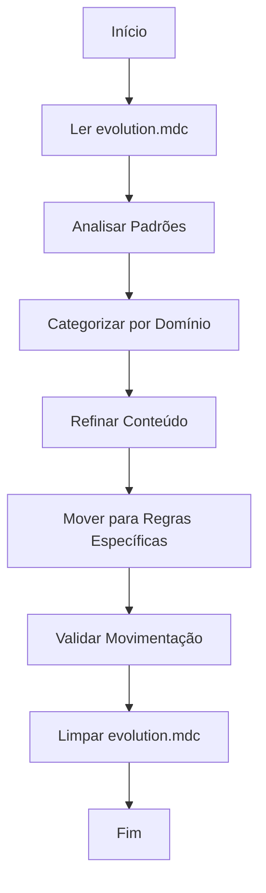

# 🔄 Mover Evolution - Refinamento e Movimentação da Pré-Regra

## 1. Contexto e Preparação

- [ ] **SEMPRE carregue** as regras de engenharia de prompt: `fetch_rules(["core/documentation/prompt-engineering-rule"])`
- [ ] **SEMPRE identifique** o arquivo `evolution.mdc` como pré-regra consolidada
- [ ] **SEMPRE faça** backup do arquivo original antes de qualquer alteração
- [ ] **SEMPRE verifique** se o arquivo segue convenções de nomenclatura adequadas

## 2. Análise e Diagnóstico

- [ ] **SEMPRE leia** completamente o arquivo `evolution.mdc` atual
- [ ] **SEMPRE identifique** padrões prontos para movimentação:
  - [ ] Padrões consolidados e comprovados
  - [ ] Lições aprendidas maduras
  - [ ] Aplicações futuras específicas
  - [ ] Padrões duplicados ou obsoletos
- [ ] **SEMPRE categorize** padrões por domínio e regra de destino
- [ ] **SEMPRE documente** estado atual antes de iniciar movimentação

## 3. Aplicação de Movimentação

### 3.1 Fase 1: Refinamento (Automático)

- [ ] **SEMPRE organize** padrões por categoria:
  - [ ] Padrões de Desenvolvimento (TDD, Clean Code, DDD)
  - [ ] Padrões de Testes (RSpec, Jest, Teaspoon)
  - [ ] Padrões de Arquitetura (Rails, Frontend, Backend)
  - [ ] Padrões de Qualidade (SOLID, Refatoração)
  - [ ] Padrões de Ferramentas (Git, Docker, CI/CD)
- [ ] **SEMPRE consolide** informações duplicadas
- [ ] **SEMPRE identifique** padrões prontos para movimentação
- [ ] **SEMPRE prepare** conteúdo para regras específicas
- [ ] **SEMPRE documente** decisões de refinamento

### 3.2 Fase 2: Movimentação

- [ ] **SEMPRE determine** regra de destino apropriada:
  - [ ] Padrões de Git → `git-rule.mdc`
  - [ ] Padrões de Testes → `jest-rule.mdc`, `rspec-rule.mdc`
  - [ ] Padrões de Arquitetura → `architecture-guidelines.mdc`
  - [ ] Padrões de Frontend → `react-rule.mdc`, `typescript-rule.mdc`
  - [ ] Padrões de Backend → `ruby-rule.mdc`, `python-rule.mdc`
- [ ] **SEMPRE mova** conteúdo para regra específica
- [ ] **SEMPRE atualize** referências e links
- [ ] **SEMPRE remova** conteúdo movido do `evolution.mdc`
- [ ] **SEMPRE valide** que movimentação foi bem-sucedida

### 3.3 Exemplos de Movimentação

#### 3.3.1 Padrões de Git

```markdown
# ✅ CORRETO - Movimentação para git-rule.mdc

## Padrões de Versionamento

### Conventional Commits

- **SEMPRE use** formato: `tipo(escopo): descrição`
- **SEMPRE inclua** breaking changes quando necessário
- **SEMPRE documente** mudanças significativas

### Estratégias de Branch

- **SEMPRE use** feature branches para novas funcionalidades
- **SEMPRE mantenha** main branch estável
- **SEMPRE faça** merge requests para revisão
```

#### 3.3.2 Padrões de Testes

```markdown
# ✅ CORRETO - Movimentação para rspec-rule.mdc

## Padrões RSpec

### Estrutura de Testes

- **SEMPRE use** `RSpec.describe` com `type` apropriado
- **SEMPRE organize** testes por funcionalidade
- **SEMPRE use** `let` para setup de dados

### Qualidade de Testes

- **SEMPRE teste** casos extremos e cenários de erro
- **SEMPRE mantenha** cobertura >90%
- **SEMPRE use** nomes descritivos para testes
```

## 4. Validação e Qualidade

### 4.1 Validação Técnica

- [ ] **SEMPRE execute** markdownlint para validação:

  ```bash
  npx markdownlint .cursor/commands/memory/move.md --fix
  ```

- [ ] **SEMPRE verifique** links funcionais:

  ```bash
  npx markdown-link-check .cursor/commands/memory/move.md
  ```

- [ ] **SEMPRE valide** estrutura hierárquica
- [ ] **SEMPRE confirme** que linguagem é imperativa

### 4.2 Checklist de Qualidade

- [ ] **SEMPRE confirme** que padrões foram movidos corretamente
- [ ] **SEMPRE verifique** se regras de destino foram atualizadas
- [ ] **SEMPRE valide** que `evolution.mdc` foi limpo adequadamente
- [ ] **SEMPRE teste** se regras movidas funcionam corretamente
- [ ] **SEMPRE documente** movimentações realizadas

## 5. Exemplos de Uso

### 5.1 Uso Básico

```bash
# Refinar e mover padrões do evolution.mdc
/move evolution
```

### 5.2 Uso com Categorização

```bash
# Mover padrões específicos por categoria
/move evolution --category=git
/move evolution --category=testing
/move evolution --category=architecture
```

### 5.3 Uso com Validação

```bash
# Mover com validação completa
/move evolution --validate
```

## 6. Troubleshooting

### 6.1 Problemas Comuns

- **Padrões não identificados**: Verifique se padrões estão maduros o suficiente
- **Regra de destino não encontrada**: Crie regra específica antes de mover
- **Conteúdo duplicado**: Consolide padrões antes de movimentação
- **Links quebrados**: Atualize referências após movimentação

### 6.2 Soluções

- **SEMPRE valide** padrões antes de movimentação
- **SEMPRE crie** regras de destino se necessário
- **SEMPRE consolide** conteúdo duplicado
- **SEMPRE atualize** referências após movimentação

## 7. Integração com Sistema

### 7.1 Arquivos Relacionados

- **Fonte**: `.cursor/rules/system/evolution.mdc`
- **Destino**: Regras específicas em `.cursor/rules/`
- **Formatação**: `.cursor/commands/command/format.md`
- **Regras**: `.cursor/rules/core/formatter/formatter-rule-core.mdc`

### 7.2 Fluxo de Trabalho



## 8. Comandos Relacionados

- `/compact evolution` - Compactar evolution.mdc antes da movimentação
- `/compact memory-core` - Compactar memória essencial
- `/format` - Formatar comandos .md

---

**Status**: Implementado e funcional
**Versão**: 1.0
**Última Atualização**: 2025-09-30
