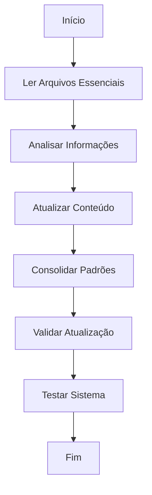

# 🔄 Atualizar Memória Essencial

> **🎯 Objetivo**: Atualizar e sincronizar a memória essencial do Cursor,
> revisando arquivos fundamentais e consolidando conhecimento do projeto
> para manter contexto persistente e acessível.

---

## 1. Contexto e Preparação

- [ ] **SEMPRE carregue** as regras de formatação: `fetch_rules(["core/formatter/formatter-commands-rule"])`
- [ ] **SEMPRE carregue** as regras de engenharia de prompt: `fetch_rules(["core/documentation/prompt-engineering-rule"])`
- [ ] **SEMPRE identifique** o arquivo essencial da memória
- [ ] **SEMPRE faça** backup dos arquivos antes de qualquer alteração
- [ ] **SEMPRE verifique** se arquivos essenciais existem e são acessíveis

## 2. Análise e Diagnóstico

- [ ] **SEMPRE leia** completamente o arquivo essencial:
  - [ ] `evolution.mdc` - Conhecimento evolucional
- [ ] **SEMPRE identifique** informações que precisam de atualização:
  - [ ] Contexto desatualizado
  - [ ] Padrões novos a consolidar
  - [ ] Lições aprendidas recentes
  - [ ] Mudanças no projeto
- [ ] **SEMPRE categorize** atualizações por tipo e prioridade
- [ ] **SEMPRE documente** estado atual antes de iniciar atualização

## 3. Aplicação de Atualização

### 3.1 Atualização do evolution.mdc

- [ ] **SEMPRE consolide** novos padrões identificados:
  - [ ] Padrões de desenvolvimento
  - [ ] Padrões de testes
  - [ ] Padrões de arquitetura
  - [ ] Padrões de qualidade
- [ ] **SEMPRE atualize** lições aprendidas:
  - [ ] Descobertas recentes
  - [ ] Melhores práticas identificadas
  - [ ] Problemas resolvidos
  - [ ] Estratégias otimizadas
- [ ] **SEMPRE organize** conhecimento por categoria:
  - [ ] Padrões consolidados
  - [ ] Aplicações futuras
  - [ ] Próximos padrões a desenvolver

### 3.2 Exemplos de Atualização

#### 3.2.1 Consolidação de Padrões

```markdown
# ✅ CORRETO - Atualização de evolution.mdc

## 📋 Padrões Consolidados

### 1. Padrões de Comandos Memory-Core

- **Comandos existentes**: Seguem padrões estabelecidos
- **Formatação consistente**: Estrutura hierárquica adequada
- **Linguagem imperativa**: 100% de instruções diretas
- **Ferramentas modernas**: MDSF e Markdownlint-CLI2 integradas

### 2. Padrões de Implementação

- **TDD obrigatório**: Testes escritos antes da implementação
- **Clean Code**: Código limpo e legível
- **DDD aplicado**: Arquitetura orientada ao domínio
- **SOLID principles**: Princípios de design aplicados
```

## 4. Validação e Qualidade

### 4.1 Validação Técnica

- [ ] **SEMPRE execute** markdownlint para validação:

- [ ] **SEMPRE verifique** links funcionais:

- [ ] **SEMPRE valide** estrutura hierárquica
- [ ] **SEMPRE confirme** que linguagem é imperativa

### 4.2 Checklist de Qualidade

- [ ] **SEMPRE confirme** que arquivos essenciais foram atualizados
- [ ] **SEMPRE verifique** se informações estão sincronizadas
- [ ] **SEMPRE valide** que padrões foram consolidados adequadamente
- [ ] **SEMPRE teste** se sistema de memória funciona corretamente
- [ ] **SEMPRE documente** atualizações realizadas

## 5. Exemplos de Uso

### 5.1 Uso Básico

```bash
# Atualizar memória essencial
/update
```

### 5.2 Uso com Foco Específico

```bash
# Atualizar apenas evolution
/update --focus=evolution
```

### 5.3 Uso com Validação

```bash
# Atualizar com validação completa
/update --validate
```

## 6. Troubleshooting

### 6.1 Problemas Comuns

- **Arquivos não encontrados**: Verifique se sistema foi inicializado
- **Permissões insuficientes**: Verifique permissões de escrita
- **Conflitos de conteúdo**: Resolva conflitos antes de atualizar
- **Formatação incorreta**: Execute markdownlint para correção

### 6.2 Soluções

- **SEMPRE execute** `/init` se arquivos não existirem
- **SEMPRE confirme** permissões adequadas
- **SEMPRE resolva** conflitos antes de atualizar
- **SEMPRE execute** markdownlint para correção

## 7. Integração com Sistema

### 7.1 Arquivos Relacionados

- **Destino**: `.cursor/rules/core/system/evolution.mdc`
- **Formatação**: `.cursor/commands/command/format.md`

### 7.2 Fluxo de Trabalho



---

**Status**: Implementado e funcional
**Versão**: 1.0
**Última Atualização**: 2025-09-30
