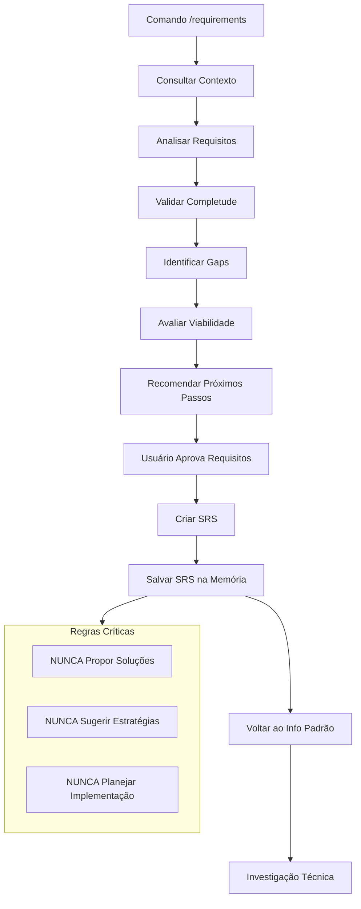

# /requirements - Análise de Engenharia de Requisitos

> **🎯 Objetivo**: Analisar requisitos de software de forma sistemática, validando completude, clareza e viabilidade técnica e de negócio para preparar especificação formal (SRS)

---

## 1. Contexto e Preparação

- [ ] **Consultar Contexto**: Consultar contexto existente e histórico de requisitos
- [ ] **Identificar Escopo**: Definir limites e objetivos da análise de requisitos
- [ ] **Mapear Fontes**: Identificar documentos, especificações e stakeholders relevantes
- [ ] **Preparar Templates**: Configurar templates para documentação de requisitos

**Automação**: Configure scripts para carregar automaticamente contexto relevante

## 2. Análise de Requisitos

### 2.1 Análise de Completude

- [ ] **Verificar Requisitos Funcionais**: Todos os requisitos funcionais estão definidos?
- [ ] **Verificar Requisitos Não-Funcionais**: Performance, segurança, usabilidade especificados?
- [ ] **Verificar Casos de Uso**: Cenários de uso estão documentados?
- [ ] **Verificar Dependências**: Pré-condições e restrições identificadas?
- [ ] **Verificar Critérios de Aceitação**: Critérios mensuráveis e testáveis definidos?

### 2.2 Análise de Clareza

- [ ] **Verificar Especificidade**: Requisitos são específicos e mensuráveis?
- [ ] **Identificar Ambiguidades**: Pontos que precisam de esclarecimento?
- [ ] **Verificar Consistência**: Requisitos não conflitam entre si?
- [ ] **Verificar Rastreabilidade**: Requisitos podem ser rastreados até origem?
- [ ] **Verificar Testabilidade**: Requisitos podem ser validados?

### 2.3 Análise de Viabilidade

- [ ] **Avaliar Viabilidade Técnica**: Requisitos são tecnicamente implementáveis?
- [ ] **Avaliar Viabilidade de Negócio**: Recursos e prazos são realistas?
- [ ] **Identificar Riscos**: Riscos técnicos e de negócio identificados?
- [ ] **Avaliar Dependências Externas**: APIs, serviços externos disponíveis?
- [ ] **Avaliar Restrições**: Limitações de tempo, custo e recursos consideradas?

**Automação**: Configure ferramentas para validação automática de consistência

## 3. Identificação de Gaps e Problemas

### 3.1 Gaps de Requisitos

- [ ] **Requisitos Faltantes**: Funcionalidades essenciais não especificadas?
- [ ] **Requisitos Incompletos**: Especificações parciais ou vagas?
- [ ] **Requisitos Ambíguos**: Especificações que podem ser interpretadas de múltiplas formas?
- [ ] **Requisitos Conflitantes**: Especificações que se contradizem?
- [ ] **Requisitos Irrealistas**: Especificações tecnicamente impossíveis?

### 3.2 Problemas de Especificação

- [ ] **Falta de Contexto**: Requisitos sem contexto de negócio?
- [ ] **Falta de Priorização**: Requisitos sem classificação de importância?
- [ ] **Falta de Validação**: Critérios de aceitação não definidos?
- [ ] **Falta de Rastreabilidade**: Requisitos sem origem clara?
- [ ] **Falta de Manutenibilidade**: Requisitos difíceis de atualizar?

**Automação**: Configure checklists para identificação sistemática de problemas

## 4. Avaliação de Escopo e Complexidade

### 4.1 Análise de Escopo

- [ ] **Definir Limites**: O que está incluído e excluído do escopo?
- [ ] **Identificar Dependências**: Requisitos que dependem de outros?
- [ ] **Avaliar Impacto**: Mudanças que afetam outros sistemas?
- [ ] **Verificar Gerenciabilidade**: Escopo pode ser gerenciado adequadamente?
- [ ] **Identificar Riscos de Escopo**: Possibilidade de expansão não controlada?

### 4.2 Análise de Complexidade

- [ ] **Avaliar Complexidade Técnica**: Nível de dificuldade de implementação?
- [ ] **Avaliar Complexidade de Integração**: Dificuldade de integração com sistemas existentes?
- [ ] **Avaliar Complexidade de Teste**: Dificuldade de validação e teste?
- [ ] **Avaliar Complexidade de Manutenção**: Dificuldade de manutenção futura?
- [ ] **Avaliar Complexidade de Deploy**: Dificuldade de implantação?

**Automação**: Configure métricas para avaliação quantitativa de complexidade

## 5. Recomendação de Próximos Passos

### 5.1 Requisitos Completos e Aprovados

- [ ] **Criar SRS**: Gerar Especificação de Requisitos de Software formal
- [ ] **Nomenclatura**: `srs-{name}.md` na pasta `.cursor/requirements/`
- [ ] **Template**: Usar template ERS completo conforme especificado
- [ ] **Aprovação**: Aguardar aprovação do usuário antes de criar SRS
- [ ] **Transição**: Voltar ao modo info padrão após criação do SRS

### 5.2 Requisitos com Gaps ou Problemas

- [ ] **Solicitar Esclarecimentos**: Identificar pontos que precisam de refinamento
- [ ] **Priorizar Gaps**: Classificar problemas por criticidade
- [ ] **Sugerir Refinamento**: Recomendar próximos passos para completar requisitos
- [ ] **Documentar Limitações**: Registrar incertezas e gaps identificados
- [ ] **Continuar Investigação**: Manter no modo info até requisitos estarem claros

**Automação**: Configure templates para geração automática de recomendações

## 6. Documentação e Validação

### 6.1 Documentação da Análise

- [ ] **Salvar Análise**: Documentar análise completa
- [ ] **Atualizar Contexto**: Atualizar arquivos de contexto relevantes
- [ ] **Registrar Descobertas**: Salvar insights e limitações identificadas
- [ ] **Manter Rastreabilidade**: Preservar ligação entre requisitos e análise
- [ ] **Preparar Próximos Passos**: Organizar informações para próximos modos

### 6.2 Validação da Análise

- [ ] **Verificar Completude**: Análise cobre todos os aspectos necessários?
- [ ] **Verificar Precisão**: Análise é baseada em evidências reais?
- [ ] **Verificar Consistência**: Análise é consistente com contexto existente?
- [ ] **Verificar Utilidade**: Análise fornece direcionamento claro?
- [ ] **Verificar Rastreabilidade**: Análise pode ser rastreada até fontes?

**Automação**: Configure scripts para atualização automática do contexto

## 7. Template de SRS (Após Aprovação)

### 7.1 Estrutura Obrigatória do SRS

```markdown
# Especificação de Requisitos de Software (ERS)

Projeto: <nome do projeto>
Versão: <versão>
Autor: <autor>

## Histórico de Revisões

| Autor | Motivo da alteração | Versão |
| ----- | ------------------- | ------ |
|       |                     |        |

## 1. Introdução

### 1.1 Objetivo do Documento

Descrever o propósito da ERS (mesmo que seja uma adição pequena).

### 1.2 Escopo do Produto

Explicar brevemente o que será feito (nova funcionalidade, correção ou melhoria).

### 1.3 Definições e Referências

Usar apenas se houver siglas, termos técnicos ou documentos externos.

## 2. Visão Geral do Produto

### 2.1 Contexto

Indicar se é parte de um sistema maior ou apenas uma modificação pontual.

### 2.2 Funções Principais

Listar de forma simples as funções ou alterações esperadas.

### 2.3 Restrições

Ex.: padrões de código, limitações técnicas, dependência de API.

### 2.4 Usuários

Indicar se a alteração afeta todos os usuários ou apenas perfis específicos.

### 2.5 Premissas e Dependências

Registrar suposições ou dependências externas.

## 3. Requisitos do Sistema

### 3.1 Interfaces Externas

- **Usuário**: UI, usabilidade
- **Hardware**: se houver
- **Software**: integração, banco de dados, APIs

### 3.2 Requisitos Funcionais

Listar o que o sistema deve fazer com a alteração.
Ex.: "O sistema deve permitir exportar relatórios em CSV."

### 3.3 Requisitos Não Funcionais

- **Desempenho**: tempo de resposta esperado
- **Segurança**: permissões de acesso
- **Confiabilidade**: disponibilidade mínima
- **Manutenibilidade**: facilidade de atualização

### 3.4 Regras de Negócio

Adicionar somente se a alteração impactar regras específicas.

### 3.5 Restrições de Projeto

Custos, prazos, tecnologias obrigatórias.

## 4. Verificação

Como será validado o requisito: testes unitários, revisão de código, homologação etc.

## 5. Anexos

Diagramas, prints, fluxos, exemplos de entrada/saída.
```

### 7.2 Instruções para o Template SRS

- **Campos obrigatórios**: Objetivo do Documento, Escopo do Produto, Funções Principais, Requisitos Funcionais, Verificação
- **Campos opcionais**: Histórico de Revisões, Definições e Referências, Contexto, Restrições, Usuários, Premissas e Dependências, Interfaces Externas, Requisitos Não Funcionais, Regras de Negócio, Restrições de Projeto, Anexos
- **NÃO incluir** os marcadores (obrigatório) ou (opcional) no arquivo gerado

**e template existe**: Padroniza especificação de requisitos e facilita implementação
**Automação**: Configure templates para geração automática de SRS

## 8. Limites e Verificação

### 8.1 Limites Absolutos

- ❌ **NUNCA proponha** soluções ou correções específicas
- ❌ **NUNCA sugira** estratégias de implementação
- ❌ **NUNCA planeje** abordagens técnicas
- ❌ **NUNCA tome** decisões sobre como resolver problemas
- ❌ **NUNCA implemente** funcionalidades
- ❌ **NUNCA modifique** arquivos existentes

### 8.2 Checklist de Qualidade

- [ ] Requisitos foram analisados completamente
- [ ] Completude e clareza foram avaliadas
- [ ] Gaps e ambiguidades foram identificados
- [ ] Viabilidade técnica foi analisada
- [ ] Recomendações foram fornecidas
- [ ] Análise foi documentada adequadamente
- [ ] **🚨 CRÍTICO**: NENHUMA solução foi proposta
- [ ] **🚨 CRÍTICO**: NENHUMA estratégia foi sugerida
- [ ] **🚨 FUNCIONALIDADE CRÍTICA**: SRS foi criado após aprovação do usuário
- [ ] **🚨 FUNCIONALIDADE CRÍTICA**: Modo voltou ao info padrão após criação do SRS
- [ ] **🚨 CRÍTICO**: NENHUM arquivo de notas foi gerado (apenas modo info padrão gera)

**Automação**: Configure linters para validar que nenhum código foi modificado

## 9. Integração com Outros Modos

### 9.1 Transição para Modo Plan

- **Quando**: Requisitos são suficientes para implementação
- **O que**: Análise de requisitos e contexto para planejamento
- **Como**: Usar `/plan` com requisitos validados
- **🚨 CRÍTICO**: NÃO sugerir soluções durante transição

### 9.2 Transição para Modo Act

- **Quando**: Requisitos são claros e completos
- **O que**: Requisitos validados para implementação direta
- **Como**: Usar `/act` com requisitos aprovados
- **🚨 CRÍTICO**: NÃO sugerir soluções durante transição

### 9.3 Recomendação de Refinamento

- **Quando**: Requisitos têm gaps ou ambiguidades
- **O que**: Solicitar esclarecimentos antes de prosseguir
- **Como**: Continuar no modo info até requisitos estarem claros
- **🚨 CRÍTICO**: NÃO sugerir soluções durante refinamento

**Automação**: Configure scripts para validar transições corretas entre modos

## 10. Fluxo de Trabalho



**Automação**: Configure scripts para validar cada etapa do processo

## 11. Referências e Contexto

### 11.1 Referências Internas

- [Core Rule](core-rule.mdc) - Diretrizes fundamentais
- [Info Mode](info-mode.mdc) - Modo de investigação
- [Plan Mode](plan-mode.mdc) - Modo de planejamento
- [Act Mode](act-mode.mdc) - Modo de implementação

### 11.2 Metodologias de Engenharia de Requisitos

- **IEEE 830**: Padrão para especificação de requisitos de software
- **Volere**: Metodologia de engenharia de requisitos
- **Agile Requirements**: Requisitos em metodologias ágeis
- **User Stories**: Especificação de requisitos orientada a usuário

**Automação**: Configure ferramentas para manter referências atualizadas automaticamente

## 12. Lembrete Importante

Este comando é **APENAS** para análise de requisitos e criação de SRS.

### 12.1 Proibições Absolutas

- **NUNCA proponha** soluções ou correções específicas
- **NUNCA sugira** estratégias de implementação
- **NUNCA planeje** abordagens técnicas
- **NUNCA tome** decisões sobre como resolver problemas

### 12.2 Funcionalidades Críticas

- **SEMPRE crie** SRS após aprovação dos requisitos pelo usuário
- **SEMPRE volte** ao modo info padrão após criação do SRS
- **SEMPRE continue** investigação técnica após requisitos aprovados
- **SEMPRE use** template obrigatório para SRS
- **SEMPRE salve** análise adequadamente

**Quando aplicar**: Sempre antes de planejar ou implementar mudanças no sistema
**Automação**: Use `/requirements` para ativar análise de requisitos automaticamente
